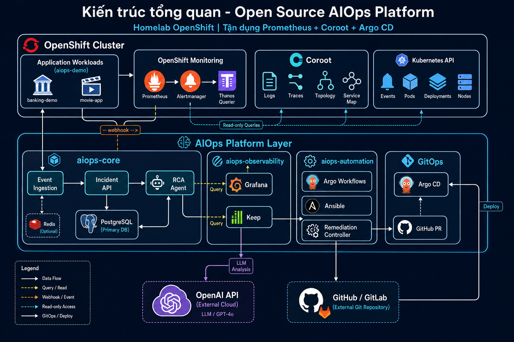

# Open Source AIOps Platform

Nền tảng AIOps mã nguồn mở chạy trên **Red Hat OpenShift**, mô phỏng các năng lực cốt lõi của IBM Cloud Pak for AIOps. Lab này dùng môi trường **dev-ocp** (reuse Coroot/Argo/Prometheus đang chạy với banking + movie).

## Mục tiêu

| # | Năng lực | Trạng thái |
|---|----------|------------|
| 1 | Thu thập alert/event từ OpenShift | Phase 2 |
| 2 | Correlation & deduplication | Phase 2 |
| 3 | Enrich incident với Kubernetes context | Phase 2 |
| 4 | Root Cause Analysis (RCA) | Phase 3 |
| 5 | AI Agent phân tích metrics/logs/traces/topology | Phase 3 |
| 6 | Remediation recommendation | Phase 4 |
| 7 | Runbook tự động (có phê duyệt) | Phase 4 |
| 8 | GitOps qua Pull Request | Phase 4 |
| 9 | Dashboard tổng hợp | Phase 5 |
| 10 | Lịch sử incident/RCA/remediation | Phase 3–4 |

**Phase hiện tại: Phase 3 (RCA Agent)** — Phase 1–2 đã xong.

## Kiến trúc tổng quan



```
OpenShift Applications
        │
        ├── OpenShift Prometheus ──► Metrics + Alertmanager alerts
        ├── Coroot ────────────────► Logs, Traces, Topology
        └── Kubernetes API ────────► Events, Pod/Node status
                         │
                         ▼
                 Event Ingestion Layer
                         │
                         ▼
               Correlation & Incident
                         │
                         ▼
                     RCA Agent (OpenAI)
                         │
               ┌─────────┴─────────┐
               ▼                   ▼
       Recommendation         Automation
                              Argo Workflows / Ansible
                              GitOps Pull Request
```

Chi tiết: [docs/architecture.md](docs/architecture.md) | [docs/high-level-design.md](docs/high-level-design.md) | [docs/roadmap.md](docs/roadmap.md) | [docs/tracing.md](docs/tracing.md) | [diagrams/](diagrams/)

## Hạ tầng yêu cầu

- Red Hat OpenShift với Prometheus, Alertmanager, Thanos Querier (built-in)
- Coroot (metrics, logs, traces, topology)
- Argo CD (GitOps)
- **Không** cài thêm Prometheus, Loki, Tempo, Jaeger, OpenSearch

### Ngân sách tài nguyên AIOps layer

| Tài nguyên | Mục tiêu |
|------------|----------|
| CPU requests | 6–8 vCPU |
| Memory requests | 16–24 GB |
| Persistent storage | 60–100 GB |

Chi tiết sizing: [docs/resource-sizing.md](docs/resource-sizing.md)

## Namespaces

| Namespace | Mục đích |
|-----------|----------|
| `aiops-core` | API, RCA Agent, PostgreSQL, Redis |
| `aiops-automation` | Argo Workflows, Ansible runbooks |
| `aiops-observability` | Grafana, integration components |
| `aiops-demo` | Banking demo, movie app, fault injection |

## Bắt đầu nhanh

### 1. Phase 0 — Discovery

Chạy các lệnh trong [docs/discovery.md](docs/discovery.md) và gửi output (không gửi secret values).

### 2. Phase 1 — GitOps (Argo CD)

Không dùng `oc apply -k bootstrap/` trên lab này. Bootstrap cũng là Application Argo (`aiops-bootstrap`).

```bash
# 1) Push repo Open-Source-AIOps-Platform (nhánh main) lên remote
# 2) Đăng ký root App of Apps MỘT LẦN (UI Argo hoặc lệnh dưới — đây là điểm vào duy nhất):
oc apply -f gitops/app-of-apps/dev-ocp-root.yaml

# Argo sẽ tạo/sync:
#   aiops-bootstrap      → path bootstrap/  (ns, RBAC, NetPol, PVC, ConfigMap)
#   aiops-core           → charts/apps Phase 2+ (manual sync cho đến khi sẵn sàng)
#   aiops-observability
#   aiops-automation
#   aiops-demo
```

Secrets (OpenAI) **không** commit Git — tạo qua Vault/ESO hoặc một lần:

```bash
oc create secret generic openai-api-key \
  -n aiops-core \
  --from-literal=OPENAI_API_KEY='sk-...' \
  --dry-run=client -o yaml | oc apply -f -
```

(Namespace `aiops-core` phải đã được `aiops-bootstrap` sync trước.)

### 3. Kiểm tra

```bash
oc get ns | grep aiops
oc get sa,role,rolebinding -n aiops-core
oc get networkpolicy -n aiops-core
oc get pvc -n aiops-core
oc get applications.argoproj.io -n argocd | grep aiops
```

## Cấu trúc repository

```
open-aiops-platform/
├── README.md
├── docs/                    # Tài liệu kiến trúc & vận hành
├── bootstrap/               # Manifest bootstrap (Kustomize)
├── gitops/                  # Argo CD applications
├── charts/                  # Helm charts
├── components/              # Source code microservices
├── integrations/            # Alertmanager, Coroot, Keep, Grafana
├── automation/              # Ansible, Argo Workflows
├── demo/                    # Demo apps & fault injection
├── scripts/                 # Helper scripts
└── tests/                   # Unit, integration, e2e
```

## Lộ trình triển khai

| Phase | Nội dung | Trạng thái |
|-------|----------|------------|
| 0 | Discovery — thu thập thông tin cluster | Done |
| 1 | Foundation — namespaces, RBAC, GitOps skeleton | Done |
| 2 | Event ingestion — Alertmanager, Incident API | Done |
| 3 | RCA Agent — evidence collection, OpenAI | Done |
| 4 | Automation — approval, GitOps PR, Ansible runbook | Done |
| 4.5 | Next Best Action — RCA → pending remediation | Done |
| 5 | Dashboard — Grafana (ops) | Done |
| 5.5 | Chat API — NL Q&A cho demo IBM | Done |
| 5.6 | React AIOps Console (Ask / Incidents / Remediations) | Done |
| 6 | Demo hardening | Planned |

## Bảo mật

- Least privilege RBAC; RCA Agent **read-only** trong phase đầu
- Secrets qua OpenShift Secret, không hardcode
- NetworkPolicy giới hạn traffic trong namespace AIOps
- LLM không thực thi kubectl trực tiếp

Chi tiết: [docs/security.md](docs/security.md)

## License

MIT — xem [LICENSE](LICENSE).
