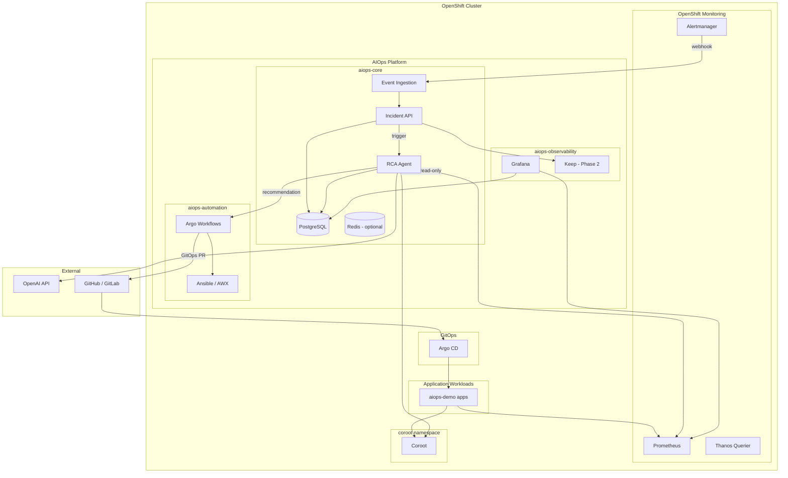

# Kiến trúc hệ thống

## 1. Tổng quan

Open Source AIOps Platform là lớp điều phối thông minh nằm **trên** hạ tầng observability có sẵn của OpenShift và Coroot. Platform không thu thập lại metrics/logs/traces mà **tổng hợp, correlate và phân tích** dữ liệu từ các nguồn hiện có.

### Nguyên tắc thiết kế

1. **Tận dụng tối đa hạ tầng có sẵn** — OpenShift Monitoring, Coroot, Argo CD.
2. **Homelab-first** — đơn giản, ít tài nguyên, không HA mặc định.
3. **Human-in-the-loop** — AI phân tích và đề xuất; automation cần phê duyệt.
4. **GitOps-first** — thay đổi cấu hình lâu dài qua Pull Request.
5. **Mở rộng dần** — monorepo, từng phase có thể deploy độc lập.

## 2. Sơ đồ kiến trúc


> Hình minh họa: toàn bộ platform trên OpenShift, luồng alert → incident → RCA → automation.
> File gốc: [diagrams/architecture-overview.png](../diagrams/architecture-overview.png)



## 3. Luồng dữ liệu chính

### 3.1 Alert → Incident

```
Alertmanager → Webhook Receiver → Event Normalizer → Incident API
                                                          │
                              Rule-based Correlation ◄────┘
                                          │
                              Incident (PostgreSQL)
                                          │
                              RCA Agent (webhook/async)
```

### 3.2 RCA Analysis

```
Incident webhook
    → Normalize payload
    → Identify affected resources (namespace, workload, pod, node)
    → Collect evidence:
        • Prometheus (CPU, memory, restarts, latency, errors)
        • Kubernetes API (describe, events, conditions)
        • Coroot (topology, logs summary, traces summary)
    → Build timeline
    → Summarize for LLM (filtered, size-limited)
    → OpenAI API → Structured JSON RCA
    → Store in PostgreSQL + audit log
```

### 3.3 Remediation (Phase 4) — Policy Mode B

**Mode B:** toàn cluster (trừ system/infra) — observe + RCA + remediation **có human approval**.

```
RCA recommendation
    → Policy engine (Mode B deny-list + action allowlist)
    → Approval API (pending → approved)
    → Execute:
        Type 1: K8s operational — restart-deployment; scale-deployment (ephemeral under Argo)
        Type 2: gitops-scale — GitHub PR on values.yaml (durable)
        Type 3: ansible-runbook — Job node-diagnostics
    → Persist remediations + audit_log (Postgres)
```

Alert onboarding: CronJob `amc-sync` gắn webhook Incident API cho mọi ns được phép.

## 4. Thành phần và trách nhiệm

| Thành phần | Namespace | Vai trò | Phase |
|------------|-----------|---------|-------|
| Event Normalizer | aiops-core | Chuẩn hóa Alertmanager/webhook payload | 2 |
| Incident API | aiops-core | CRUD incident, correlation rules | 2 |
| Keep | aiops-core hoặc riêng | Alert correlation UI, workflow | 2 |
| RCA Agent | aiops-core | Evidence collection + OpenAI RCA | 3 |
| PostgreSQL | aiops-core | Incident, RCA, audit history | 2 |
| Redis | aiops-core | Queue/cache (nếu cần) | TBD |
| Grafana | aiops-observability | Dashboard | 5 |
| Argo Workflows | aiops-automation | Remediation orchestration (optional) | 4 |
| Remediation Controller | aiops-automation | Approve + execute (Mode B) | 4 |
| Robusta | TBD | K8s event enrichment | 2 (optional) |

## 5. Tích hợp nguồn dữ liệu

### 5.1 OpenShift Prometheus

- **Endpoint**: Thanos Querier hoặc Prometheus route trong `openshift-monitoring`
- **Dùng cho**: metric queries (CPU, memory, restarts, latency, error rate)
- **Giả định**: ServiceMonitor đã scrape workloads demo

### 5.2 Coroot

- **Endpoint**: Route/Service trong namespace `coroot` (cần xác nhận qua discovery)
- **Dùng cho**: service topology, dependencies, log/trace summaries, app health
- **Giả định**: Coroot API khả dụng; abstraction layer sẽ adapt theo API thực tế

### 5.3 Kubernetes API

- **Quyền**: read-only ClusterRole cho RCA Agent
- **Dùng cho**: pods, events, deployments, nodes, PVC, HPA

### 5.4 Alertmanager

- **Webhook**: POST tới Event Normalizer / Incident API
- **Receiver config**: thêm vào AlertmanagerConfig (Phase 2)

## 6. Correlation — hai tầng

### Tầng 1: Rule-based (Phase 2)

Nhóm alert theo:
- `namespace`, `cluster`, `service`, `deployment`, `pod_owner`, `node`
- `alertname`, labels, time window (mặc định 5 phút)
- dependency topology từ Coroot (khi có)

### Tầng 2: AI-assisted (Phase 3+)

- Phân biệt symptom vs root cause
- So sánh incident lịch sử
- Đề xuất title/summary
- **Không** gửi raw logs vào LLM

## 7. Mô hình bảo mật

```
┌─────────────────────────────────────────────────┐
│  RCA Agent SA        → ClusterRole (read-only)  │
│  Automation SA       → Role (write, scoped)     │
│  Incident API SA     → Role (namespace-scoped)  │
│  NetworkPolicy       → deny-by-default + allow  │
│  OpenAI API Key      → Secret (aiops-core)      │
└─────────────────────────────────────────────────┘
```

LLM output → structured JSON only → Policy engine → Approval → Automation executor.

## 8. Giả định (cần xác nhận qua Phase 0)

| # | Giả định | Cách xác nhận |
|---|----------|---------------|
| G1 | OpenShift 4.x với User Workload Monitoring enabled | `oc get prometheus -A` |
| G2 | Coroot deployed trong namespace `coroot` | `oc get all -n coroot` |
| G3 | Argo CD trong `openshift-gitops` hoặc tương đương | `oc get applications.argoproj.io -A` |
| G4 | StorageClass NFS khả dụng | `oc get storageclass` |
| G5 | Thanos Querier expose được trong cluster | `oc get route -n openshift-monitoring` |
| G6 | Coroot API documented / discoverable | Discovery + API probe |
| G7 | 2 worker nodes, 4 vCPU / 16 GB mỗi node | `oc get nodes -o wide` |

## 9. Không nằm trong phạm vi

- Cài đặt Prometheus, Loki, Tempo, Jaeger, OpenSearch mới
- HA PostgreSQL/Redis trong homelab
- Kafka message bus
- Ollama / local LLM (phase đầu dùng OpenAI API)
- Cluster-admin cho application components

## 10. Tham chiếu

- [High-Level Design](high-level-design.md)
- [Resource Sizing](resource-sizing.md)
- [Security](security.md)
- [Discovery Checklist](discovery.md)
