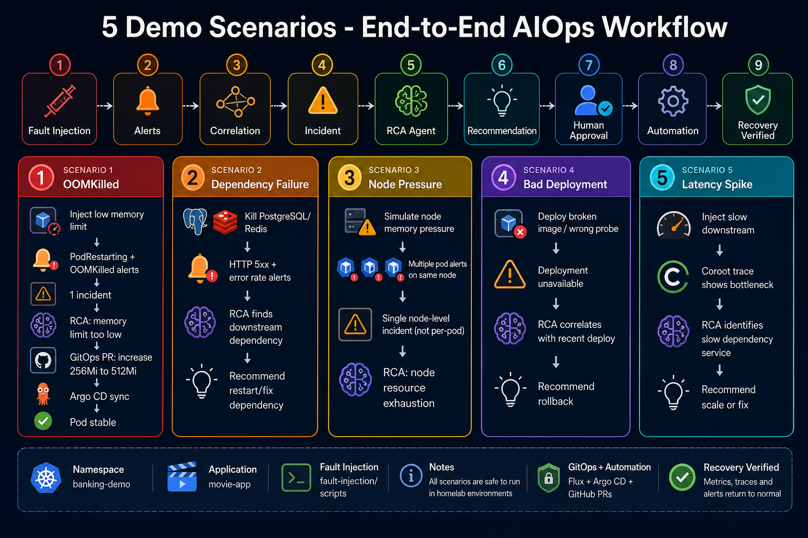

# Demo Scenarios

> Chi tiết đầy đủ sẽ được tạo trong Phase 6.

> Hình minh họa: pipeline end-to-end và 5 kịch bản demo.
> File gốc: [diagrams/demo-scenarios-flow.png](../diagrams/demo-scenarios-flow.png)

| # | Scenario | Mô tả ngắn |
|---|----------|------------|
| 1 | OOMKilled | Payment service OOM → correlation → RCA → GitOps PR |
| 2 | Dependency failure | Downstream DB/Redis lỗi → HTTP 5xx |
| 3 | Node pressure | Node memory/disk pressure → node-level incident |
| 4 | Bad deployment | Image lỗi / probe sai → rollback |
| 5 | Latency increase | Coroot trace → downstream bottleneck |

Xem `demo/` directory (Phase 6).
