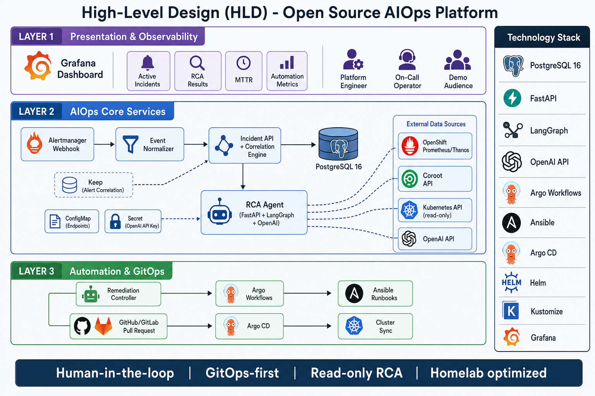

# High-Level Design (HLD)

## 1. Phạm vi

Tài liệu mô tả thiết kế cấp cao cho Open Source AIOps Platform trên OpenShift homelab. Phase 1 (Foundation) tập trung vào bootstrap infrastructure; các microservice logic triển khai từ Phase 2 trở đi.

## 2. Stakeholders & use cases

| Actor | Use case |
|-------|----------|
| Platform engineer (bạn) | Deploy, configure, troubleshoot platform |
| On-call (cùng người) | Nhận incident, xem RCA, approve remediation |
| Demo audience | Quan sát 5 failure scenarios tự động hóa |

## 3. Component diagram



> Hình minh họa: 3 tầng Observability → Core Services → Automation/GitOps.
> File gốc: [diagrams/high-level-design.png](../diagrams/high-level-design.png)

```
┌──────────────────────────────────────────────────────────────────┐
│                        aiops-observability                        │
│  ┌──────────┐  ┌─────────────────────────────────────────────┐ │
│  │ Grafana  │  │ Integration configs (datasources, dashboards)│ │
│  └──────────┘  └─────────────────────────────────────────────┘ │
└──────────────────────────────────────────────────────────────────┘
                              ▲
                              │ query
┌──────────────────────────────────────────────────────────────────┐
│                           aiops-core                              │
│                                                                   │
│  ┌─────────────┐   ┌──────────────┐   ┌─────────────────────┐   │
│  │ Alertmanager│──►│Event         │──►│ Incident API        │   │
│  │  webhook    │   │Normalizer    │   │ + Correlation Engine│   │
│  └─────────────┘   └──────────────┘   └──────────┬──────────┘   │
│                                                   │              │
│  ┌─────────────┐   ┌──────────────┐   ┌─────────▼──────────┐  │
│  │ Keep        │◄──│              │──►│ RCA Agent           │  │
│  │ (Phase 2)   │   │  PostgreSQL  │   │ (FastAPI + LangGraph)│  │
│  └─────────────┘   └──────────────┘   └─────────┬──────────┘  │
│                                                   │              │
│  ConfigMap: endpoints          Secret: OpenAI key│              │
└───────────────────────────────────┬───────────────┼──────────────┘
                                    │               │
         ┌──────────────────────────┼───────────────┼──────────────┐
         │                          │               │              │
         ▼                          ▼               ▼              ▼
  openshift-monitoring          coroot         Kubernetes API   OpenAI API
  (Prometheus/Thanos)                                              │
                                                                    │
┌──────────────────────────────────────────────────────────────────┐
│                        aiops-automation                           │
│  ┌──────────────────┐  ┌─────────────┐  ┌────────────────────┐  │
│  │ Remediation      │  │ Argo        │  │ Ansible playbooks  │  │
│  │ Controller       │──│ Workflows   │──│ (node diagnostics) │  │
│  └──────────────────┘  └─────────────┘  └────────────────────┘  │
│           │                        │                              │
│           └────────────────────────┼──► GitHub/GitLab PR          │
└────────────────────────────────────┼─────────────────────────────┘
                                     ▼
                              Argo CD → cluster sync
```

## 4. Technology choices

| Concern | Choice | Lý do |
|---------|--------|-------|
| Incident store | PostgreSQL 16 | Đủ cho homelab, ACID, JSON support |
| Cache/queue | Redis (optional) | Chỉ khi cần async queue — tránh over-provision |
| Alert correlation | Keep | Open-source, webhook-friendly, incident workflow |
| K8s enrichment | Robusta (optional) | Prometheus alerts + K8s context |
| RCA runtime | Python 3.12 + FastAPI | Ecosystem K8s/Prometheus clients |
| AI workflow | LangGraph (Phase 3) | Stateful agent workflow, nhẹ hơn full framework |
| LLM | OpenAI API | Phase đầu — không cần GPU local |
| Automation | Argo Workflows + Ansible | Native trên OpenShift, GitOps-friendly |
| GitOps | Argo CD | Đã có trên cluster |
| Packaging | Helm + Kustomize | Helm cho apps, Kustomize cho bootstrap |
| Dashboard | Grafana | Đã quen thuộc, datasource Prometheus + PostgreSQL |

## 5. Namespace design

```text
aiops-core
├── incident-api
├── event-normalizer
├── rca-agent
├── postgresql
└── redis (optional)

aiops-automation
├── argo-workflows
├── remediation-controller
└── ansible-automation (hoặc AWX nếu đủ tài nguyên)

aiops-observability
├── grafana
└── integration-config

aiops-demo
├── banking-demo
├── movie-app
└── fault-injection
```

**Keep**: nếu Helm chart yêu cầu namespace riêng, tạo `aiops-keep` và document lý do trong `integrations/keep/README.md` (Phase 2).

## 6. API contracts (preview)

### 6.1 Incident API (Phase 2)

```
POST   /api/v1/incidents              # Create from normalized alert
GET    /api/v1/incidents              # List with filters
GET    /api/v1/incidents/{id}         # Get detail
PATCH  /api/v1/incidents/{id}         # Update status
POST   /api/v1/incidents/{id}/analyze # Trigger RCA
GET    /health/live
GET    /health/ready
GET    /metrics
```

### 6.2 RCA Agent (Phase 3)

```
POST   /api/v1/analyze                # Analyze incident (webhook)
GET    /api/v1/analysis/{incident_id} # Get RCA result
GET    /health/live
GET    /health/ready
GET    /metrics
```

### 6.3 RCA output schema

Xem `components/rca-agent/src/rca_agent/schemas/rca_output.py` (Phase 3). Ví dụ:

```json
{
  "incident_id": "INC-00001",
  "status": "analyzed",
  "affected_service": "payment-service",
  "affected_namespace": "banking-demo",
  "probable_root_cause": "...",
  "confidence": 0.91,
  "supporting_evidence": ["..."],
  "business_impact": "...",
  "recommended_actions": ["..."],
  "automation_available": true,
  "automation_requires_approval": true,
  "recommended_runbook": "increase-memory-limit-gitops"
}
```

## 7. Data model (preview)

### incidents

| Column | Type | Mô tả |
|--------|------|-------|
| id | UUID | Primary key |
| external_id | VARCHAR | INC-00001 |
| title | TEXT | Incident title |
| status | ENUM | open, analyzing, analyzed, resolved |
| severity | ENUM | critical, high, medium, low |
| namespace | VARCHAR | Affected namespace |
| workload | VARCHAR | Deployment/StatefulSet name |
| alert_fingerprints | JSONB | Grouped alert IDs |
| created_at | TIMESTAMPTZ | |
| updated_at | TIMESTAMPTZ | |

### rca_results

| Column | Type | Mô tả |
|--------|------|-------|
| id | UUID | |
| incident_id | UUID FK | |
| result | JSONB | Full RCA JSON schema |
| confidence | FLOAT | |
| model | VARCHAR | gpt-4o, etc. |
| created_at | TIMESTAMPTZ | |

### audit_log

| Column | Type | Mô tả |
|--------|------|-------|
| id | UUID | |
| actor | VARCHAR | user/system/component |
| action | VARCHAR | analyze, approve, execute, reject |
| resource_type | VARCHAR | incident, remediation |
| resource_id | UUID | |
| details | JSONB | |
| created_at | TIMESTAMPTZ | |

## 8. Deployment model

### GitOps flow

```
Developer push → GitHub/GitLab
       │
       ▼
Argo CD (app-of-apps)
       ├── bootstrap (namespaces, RBAC) — one-time hoặc sync
       ├── aiops-core apps
       ├── aiops-observability apps
       ├── aiops-automation apps
       └── aiops-demo apps
```

### App of Apps hierarchy

```
homelab-root (Application)
├── aiops-bootstrap
├── aiops-core
│   ├── postgresql
│   ├── incident-api (Phase 2)
│   └── rca-agent (Phase 3)
├── aiops-observability
│   └── grafana
├── aiops-automation (Phase 4)
└── aiops-demo (Phase 6)
```

## 9. Non-functional requirements

| NFR | Target |
|-----|--------|
| Availability | Best-effort homelab (single replica) |
| RCA latency | < 60s cho incident điển hình |
| Resource budget | 6–8 CPU, 16–24 GB RAM requests |
| Storage | 60–100 GB PVC total |
| Security | Read-only RCA; approval before automation |
| Observability | Prometheus metrics từ mọi service |

## 10. Phase 1 deliverables (hiện tại)

- [x] Repository structure
- [x] Namespace manifests
- [x] RBAC (RCA Agent read-only)
- [x] NetworkPolicy cơ bản
- [x] Secret template (OpenAI)
- [x] ConfigMap endpoints
- [x] Argo CD App of Apps skeleton
- [x] Helm chart skeleton (rca-agent)
- [x] Resource sizing document
- [x] Discovery checklist

## 11. Rủi ro và giảm thiểu

| Rủi ro | Giảm thiểu |
|--------|------------|
| Coroot API không documented | Abstraction layer + discovery probe |
| OpenShift SCC chặn container | Non-root, arbitrary UID, no privileged |
| Tài nguyên không đủ | Sizing conservative, optional components off |
| OpenAI cost | Summarize evidence trước khi gửi LLM |
| Alert noise | Rule-based correlation trước AI |

## 12. Tài liệu liên quan

- [Architecture](architecture.md)
- [Resource Sizing](resource-sizing.md)
- [Security](security.md)
- [Discovery](discovery.md)
