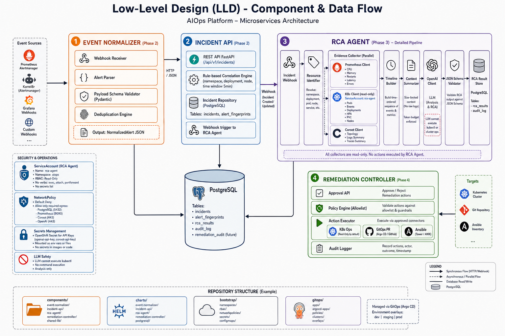

# Low-Level Design (LLD)

> Tài liệu chi tiết sẽ được bổ sung từ Phase 2 trở đi.

## Sơ đồ component chi tiết

> Hình minh họa: microservices, modules nội bộ, data flow và security constraints.
> File gốc: [diagrams/low-level-design.png](../diagrams/low-level-design.png)

## Phase 1 scope

- Bootstrap manifests (namespaces, RBAC, NetworkPolicy, PVC)
- ConfigMaps và Secret templates
- Helm chart skeleton cho RCA Agent
- GitOps App of Apps skeleton

## Modules (planned)

| Module | Package | Phase |
|--------|---------|-------|
| Event Normalizer | `components/event-normalizer/` | 2 |
| Incident API | `components/incident-api/` | 2 |
| RCA Agent | `components/rca-agent/` | 3 |
| Remediation Controller | `components/remediation-controller/` | 4 |
