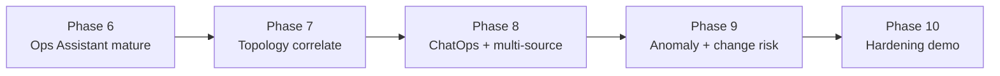

# Roadmap — Open Source AIOps Platform vs CP4AIOps

Mục tiêu: nâng lab từ **~20% full-product / ~40% core AIOps loop** lên mức demo thuyết phục hơn, **không** cố đạt parity Cloud Pak.

**Nguyên tắc**
- Mở rộng **context pack + collector**, không vá từng câu hỏi chat.
- Human-in-the-loop giữ nguyên (AI đề xuất → người approve).
- Ưu tiên thứ gì **nhìn thấy trong demo** trước.

---

## Baseline (hiện tại) — Phase 0–5 đã có

| Đã có | Ghi chú |
|-------|---------|
| Alertmanager → Incident + dedupe | Phase 2 |
| RCA (LLM) + K8s evidence + NBA | Phase 3–4 |
| Remediation approve → execute | restart / gitops-scale / ansible |
| Policy observe vs remediate | Mode B |
| Grafana + AIOps Console (Ask) | Phase 5 + chat |
| Platform context pack (metrics, failures, inventory) | Ops assistant |
| App OTLP → Coroot + Instana (shared collector) | Same pattern as banking; see [docs/tracing.md](tracing.md) |

**Ước lượng:** ~35–45% core loop · ~15–25% full CP4AIOps.

---

## Bản đồ phase

| Phase | Tên | Thời gian gợi ý* | Core loop | Full CP4 |
|-------|-----|------------------|-----------|----------|
| **6** | Ops Assistant mature | 1–2 tuần | ~50% | ~25% |
| **7** | Topology & smarter correlation | 2–3 tuần | ~60% | ~35% |
| **8** | ChatOps + connectors | 2–3 tuần | ~70% | ~45% |
| **9** | Anomaly + change risk (lite) | 3–4 tuần | ~75% | ~55% |
| **10** | Production-ish lab hardening | 1–2 tuần | ~80% | ~55–60% |

\*Homelab 1 người, parallel với demo banking/movie. Trần thực tế **~55–60% full product** — phần còn lại (enterprise scale, 90+ connector, ML train enterprise) cố ý out-of-scope.

---

## Phase 6 — Ops Assistant mature *(code done — deploy to activate)*

**Mục tiêu:** Hỏi nhiều câu về hệ thống đang vận hành, trả lời đúng, ổn định.

| # | Deliverable | Status |
|---|-------------|--------|
| 6.1 | `ops/context` + evidence normalize | Done |
| 6.2 | Prometheus auth RBAC + richer pack (events/PVC/HPA/**disk**) | Done |
| 6.2b | Ollama via Argo (`aiops-ollama`) + Job pull `qwen2.5:3b` | Done |
| 6.3 | Conversation memory (`session_id`, ~10 turns) | Done |
| 6.4 | Suggest next questions in Console | Done |
| 6.5 | Audit chat turns → Postgres `chat_turns` | Done |

**Deploy:** rebuild `rca-agent`, `incident-api`, `aiops-console`; apply monitoring-view + platform ConfigMap; `ollama pull qwen2.5:3b`.

**Không làm ở phase này:** Slack, topology graph, ML anomaly.

---

## Phase 7 — Topology & correlation

**Mục tiêu:** Correlate / RCA theo **quan hệ dịch vụ**, gần CP4 topology path (lite).

| # | Deliverable | Status |
|---|-------------|--------|
| 7.1 | Service dependency graph (Coroot live map + static fallback) | **Done (7B)** — prefer `overview/map` / AppMap |
| 7.2 | Incident blast radius = upstream/downstream 1–2 hop | **Done** — `ImpactScope.upstream/downstream` |
| 7.3 | Correlation: cùng topology path → 1 incident | **Done** — fingerprint **or** related workloads |
| 7.4 | Console: mini topology view cho incident | **Done** — Incidents click → blast radius panel |
| 7.5 | Enrich RCA prompt bằng neighbor services | **Done** — Topo evidence + topology JSON in LLM |

**Demo:** Fault `transfer-service` → incident cũng nêu `frontend` / `account-service` bị ảnh hưởng.

**Docs:** [topology.md](topology.md)

**% sau phase:** core ~60% · full ~35%.

---

## Phase 8 — ChatOps + multi-source ingest

**Mục tiêu:** Vận hành qua chat team + bớt phụ thuộc chỉ Alertmanager.

| # | Deliverable |
|---|-------------|
| 8.1 | Slack (hoặc Mattermost) bot: hỏi ops / nhận tóm tắt incident |
| 8.2 | Approve remediation từ Slack (button → API) với audit |
| 8.3 | Connector #2: GitHub/Argo sync events → “change context” |
| 8.4 | Connector #3 (optional): webhook generic JSON → normalizer |
| 8.5 | Keep/Noise UI hoặc filter severity trong Console |

**Demo:** Alert → Slack mention → Ask trong Slack → Approve restart.

**% sau phase:** core ~70% · full ~45%.

---

## Phase 9 — Anomaly + change risk (lite)

**Mục tiêu:** Proactive nhẹ — không train ML enterprise, dùng rule + LLM + baseline đơn giản.

| # | Deliverable |
|---|-------------|
| 9.1 | Metric baseline: CPU/mem p95 7 ngày → alert “unusual” nội bộ |
| 9.2 | Log signature (optional): đếm ERROR spike qua Coroot/Promtail nếu có |
| 9.3 | Change risk lite: trước/sau Argo sync hoặc PR merge → gắn vào incident |
| 9.4 | “Similar past incidents” — search Postgres theo subtype + workload |
| 9.5 | NBA ưu tiên action đã succeed trước đó cho cùng subtype |

**Demo:** Deploy xấu → change risk “high” → RCA liên kết commit/PR.

**% sau phase:** core ~75% · full ~55%.

---

## Phase 10 — Hardening & demo polish

| # | Deliverable |
|---|-------------|
| 10.1 | E2E demo scenarios documented + scriptable fault injection |
| 10.2 | RBAC Console (OpenShift OAuth) — viewer vs approver |
| 10.3 | Backup Postgres, runbook disaster recovery lab |
| 10.4 | SLO dashboard: MTTA / MTTR từ incident timestamps |
| 10.5 | So sánh 1-pager “Open AIOps vs CP4AIOps” cho stakeholder |

**Trần lab:** ~80% core loop · ~55–60% full product narrative.

---

## Out of scope (cố ý)

- 90+ commercial connectors, Netcool/Instana deep parity  
- Trainable enterprise ML pipelines như Cloud Pak  
- HA multi-AZ, 700 concurrent users  
- Full Runbook Automation product (async poll DSL)  
- Security SOC / SIEM automation  

→ Giữ project là **OpenShift AIOps lab có thể demo**, không clone IBM.

---

## Ưu tiên nếu chỉ còn 2–3 tuần

1. **Phase 6** (ổn định Ask + metrics + memory) — bắt buộc  
2. **Phase 7.1–7.3** (topology lite) — khác biệt rõ với “chỉ giải thích alert”  
3. **Phase 8.1–8.2** (Slack) — wow factor demo  

---

## Theo dõi tiến độ

Cập nhật bảng dưới mỗi khi merge phase:

| Milestone | Target date | Status | Core % | Full % |
|-----------|-------------|--------|--------|--------|
| Baseline (Phase 5+) | — | Done | ~40% | ~20% |
| Phase 6 | — | **Implemented (code)** | ~50% | ~25% |
| Phase 7 | — | **Implemented (code)** | ~60% | ~35% |
| Phase 8 | TBD | Planned | ~70% | ~45% |
| Phase 9 | TBD | Planned | ~75% | ~55% |
| Phase 10 | TBD | Planned | ~80% | ~55–60% |

---

## Liên kết

- [architecture.md](architecture.md) · [chat.md](chat.md) · [topology.md](topology.md) · [runbooks.md](runbooks.md) · [demo-scenarios.md](demo-scenarios.md) · [ollama.md](ollama.md)  
- CP4AIOps overview: https://www.ibm.com/products/cloud-pak-for-aiops
